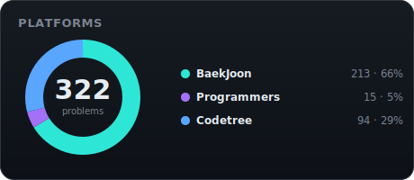
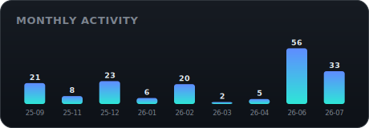

# 알고리즘 공부 저장소

## 📊 전체 현황

 

## 폴더 구조
- **trail2/, trail4/**: 코드트리 트레일 문제 (문제별 폴더 + 풀이)
- **백준/**: 백준 문제. 티어(Bronze/Silver/Gold)별 분류.
- **백준 단계별로 풀어보기/**: 백준 단계별 커리큘럼 문제
- **프로그래머스/**: 프로그래머스 코딩 테스트 문제 (레벨별)
- **scripts/**: README 자동 생성 파이프라인

## 백준 문제 정리

티어별로 정리되어 있으며, 세부 난이도는 solved.ac 기준입니다.

📁 <b>Bronze</b> · 1문제

| 번호 | 제목 | 난이도 |
| --- | --- | --- |
| [11653](https://www.acmicpc.net/problem/11653) | 소인수분해 | Bronze I |

📁 <b>Silver</b> · 52문제

| 번호 | 제목 | 난이도 |
| --- | --- | --- |
| [1026](https://www.acmicpc.net/problem/1026) | 보물 | Silver IV |
| [1822](https://www.acmicpc.net/problem/1822) | 차집합 | Silver IV |
| [1920](https://www.acmicpc.net/problem/1920) | 수 찾기 | Silver IV |
| [2217](https://www.acmicpc.net/problem/2217) | 로프 | Silver IV |
| [2847](https://www.acmicpc.net/problem/2847) | 게임을 만든 동준이 | Silver IV |
| [9613](https://www.acmicpc.net/problem/9613) | GCD 합 | Silver IV |
| [10610](https://www.acmicpc.net/problem/10610) | 30 | Silver IV |
| [10816](https://www.acmicpc.net/problem/10816) | 숫자 카드 2 | Silver IV |
| [11399](https://www.acmicpc.net/problem/11399) | ATM | Silver IV |
| [11866](https://www.acmicpc.net/problem/11866) | 요세푸스 문제 0 | Silver IV |
| [1463](https://www.acmicpc.net/problem/1463) | 1로 만들기 | Silver III |
| [1929](https://www.acmicpc.net/problem/1929) | 소수 구하기 | Silver III |
| [2075](https://www.acmicpc.net/problem/2075) | N번째 큰 수 | Silver III |
| [2579](https://www.acmicpc.net/problem/2579) | 계단 오르기 | Silver III |
| [2606](https://www.acmicpc.net/problem/2606) | 바이러스 | Silver III |
| [11659](https://www.acmicpc.net/problem/11659) | 구간 합 구하기 4 | Silver III |
| [15654](https://www.acmicpc.net/problem/15654) | N과 M （5） | Silver III |
| [15655](https://www.acmicpc.net/problem/15655) | N과 M （6） | Silver III |
| [15656](https://www.acmicpc.net/problem/15656) | N과 M （7） | Silver III |
| [15657](https://www.acmicpc.net/problem/15657) | N과 M （8） | Silver III |
| [1012](https://www.acmicpc.net/problem/1012) | 유기농 배추 | Silver II |
| [1541](https://www.acmicpc.net/problem/1541) | 잃어버린 괄호 | Silver II |
| [1654](https://www.acmicpc.net/problem/1654) | 랜선 자르기 | Silver II |
| [1927](https://www.acmicpc.net/problem/1927) | 최소 힙 | Silver II |
| [2805](https://www.acmicpc.net/problem/2805) | 나무 자르기 | Silver II |
| [5567](https://www.acmicpc.net/problem/5567) | 결혼식 | Silver II |
| [6603](https://www.acmicpc.net/problem/6603) | 로또 | Silver II |
| [11051](https://www.acmicpc.net/problem/11051) | 이항 계수 2 | Silver II |
| [11501](https://www.acmicpc.net/problem/11501) | 주식 | Silver II |
| [11724](https://www.acmicpc.net/problem/11724) | 연결 요소의 개수 | Silver II |
| [11725](https://www.acmicpc.net/problem/11725) | 트리의 부모 찾기 | Silver II |
| [15663](https://www.acmicpc.net/problem/15663) | N과 M （9） | Silver II |
| [15664](https://www.acmicpc.net/problem/15664) | N과 M （10） | Silver II |
| [15665](https://www.acmicpc.net/problem/15665) | N과 M （11） | Silver II |
| [15666](https://www.acmicpc.net/problem/15666) | N과 M （12） | Silver II |
| [16401](https://www.acmicpc.net/problem/16401) | 과자 나눠주기 | Silver II |
| [1149](https://www.acmicpc.net/problem/1149) | RGB거리 | Silver I |
| [1325](https://www.acmicpc.net/problem/1325) | 효율적인 해킹 | Silver I |
| [1697](https://www.acmicpc.net/problem/1697) | 숨바꼭질 | Silver I |
| [1926](https://www.acmicpc.net/problem/1926) | 그림 | Silver I |
| [1991](https://www.acmicpc.net/problem/1991) | 트리 순회 | Silver I |
| [2178](https://www.acmicpc.net/problem/2178) | 미로 탐색 | Silver I |
| [2468](https://www.acmicpc.net/problem/2468) | 안전 영역 | Silver I |
| [2583](https://www.acmicpc.net/problem/2583) | 영역 구하기 | Silver I |
| [2667](https://www.acmicpc.net/problem/2667) | 단지번호붙이기 | Silver I |
| [5014](https://www.acmicpc.net/problem/5014) | 스타트링크 | Silver I |
| [6064](https://www.acmicpc.net/problem/6064) | 카잉 달력 | Silver I |
| [6118](https://www.acmicpc.net/problem/6118) | 숨바꼭질 | Silver I |
| [7562](https://www.acmicpc.net/problem/7562) | 나이트의 이동 | Silver I |
| [11286](https://www.acmicpc.net/problem/11286) | 절댓값 힙 | Silver I |
| [11403](https://www.acmicpc.net/problem/11403) | 경로 찾기 | Silver I |
| [12852](https://www.acmicpc.net/problem/12852) | 1로 만들기 2 | Gold V |

📁 <b>Gold</b> · 47문제

| 번호 | 제목 | 난이도 |
| --- | --- | --- |
| [1759](https://www.acmicpc.net/problem/1759) | 암호 만들기 | Gold V |
| [1931](https://www.acmicpc.net/problem/1931) | 회의실 배정 | Gold V |
| [2230](https://www.acmicpc.net/problem/2230) | 수 고르기 | Gold V |
| [2467](https://www.acmicpc.net/problem/2467) | 용액 | Gold V |
| [2660](https://www.acmicpc.net/problem/2660) | 회장뽑기 | Gold V |
| [6593](https://www.acmicpc.net/problem/6593) | 상범 빌딩 | Gold V |
| [7569](https://www.acmicpc.net/problem/7569) | 토마토 | Gold V |
| [7576](https://www.acmicpc.net/problem/7576) | 토마토 | Gold V |
| [10026](https://www.acmicpc.net/problem/10026) | 적록색약 | Gold V |
| [12919](https://www.acmicpc.net/problem/12919) | A와 B 2 | Gold V |
| [14503](https://www.acmicpc.net/problem/14503) | 로봇 청소기 | Gold V |
| [14921](https://www.acmicpc.net/problem/14921) | 용액 합성하기 | Gold V |
| [18869](https://www.acmicpc.net/problem/18869) | 멀티버스 Ⅱ | Gold V |
| [1043](https://www.acmicpc.net/problem/1043) | 거짓말 | Gold IV |
| [1197](https://www.acmicpc.net/problem/1197) | 최소 스패닝 트리 | Gold IV |
| [1253](https://www.acmicpc.net/problem/1253) | 좋다 | Gold IV |
| [1504](https://www.acmicpc.net/problem/1504) | 특정한 최단 경로 | Gold IV |
| [1647](https://www.acmicpc.net/problem/1647) | 도시 분할 계획 | Gold IV |
| [1707](https://www.acmicpc.net/problem/1707) | 이분 그래프 | Gold IV |
| [1715](https://www.acmicpc.net/problem/1715) | 카드 정렬하기 | Gold IV |
| [1744](https://www.acmicpc.net/problem/1744) | 수 묶기 | Gold IV |
| [1753](https://www.acmicpc.net/problem/1753) | 최단경로 | Gold IV |
| [1806](https://www.acmicpc.net/problem/1806) | 부분합 | Gold IV |
| [2295](https://www.acmicpc.net/problem/2295) | 세 수의 합 | Gold IV |
| [2573](https://www.acmicpc.net/problem/2573) | 빙산 | Gold IV |
| [2617](https://www.acmicpc.net/problem/2617) | 구슬 찾기 | Gold IV |
| [3151](https://www.acmicpc.net/problem/3151) | 합이 0 | Gold IV |
| [4803](https://www.acmicpc.net/problem/4803) | 트리 | Gold IV |
| [5427](https://www.acmicpc.net/problem/5427) | 불 | Gold IV |
| [11000](https://www.acmicpc.net/problem/11000) | 강의실 배정 | Gold IV |
| [11404](https://www.acmicpc.net/problem/11404) | 플로이드 | Gold IV |
| [13975](https://www.acmicpc.net/problem/13975) | 파일 합치기 3 | Gold IV |
| [14938](https://www.acmicpc.net/problem/14938) | 서강그라운드 | Gold IV |
| [16398](https://www.acmicpc.net/problem/16398) | 행성 연결 | Gold IV |
| [21940](https://www.acmicpc.net/problem/21940) | 가운데에서 만나기 | Gold IV |
| [1238](https://www.acmicpc.net/problem/1238) | 파티 | Gold III |
| [2206](https://www.acmicpc.net/problem/2206) | 벽 부수고 이동하기 | Gold III |
| [2252](https://www.acmicpc.net/problem/2252) | 줄 세우기 | Gold III |
| [2457](https://www.acmicpc.net/problem/2457) | 공주님의 정원 | Gold III |
| [2623](https://www.acmicpc.net/problem/2623) | 음악프로그램 | Gold III |
| [4179](https://www.acmicpc.net/problem/4179) | 불！ | Gold III |
| [11779](https://www.acmicpc.net/problem/11779) | 최소비용 구하기 2 | Gold III |
| [1655](https://www.acmicpc.net/problem/1655) | 가운데를 말해요 | Gold II |
| [1766](https://www.acmicpc.net/problem/1766) | 문제집 | Gold II |
| [1781](https://www.acmicpc.net/problem/1781) | 컵라면 | Gold II |
| [11780](https://www.acmicpc.net/problem/11780) | 플로이드 2 | Gold II |
| [21276](https://www.acmicpc.net/problem/21276) | 계보 복원가 호석 | Gold II |

## 백준 단계별로 풀어보기

📁 <b>1. 입출력과 사칙연산</b> · 13문제

| 번호 | 제목 | 난이도 |
| --- | --- | --- |
| [1000](https://www.acmicpc.net/problem/1000) | A+B | Bronze V |
| [1001](https://www.acmicpc.net/problem/1001) | A-B | Bronze V |
| [1008](https://www.acmicpc.net/problem/1008) | A/B | Bronze V |
| [10171](https://www.acmicpc.net/problem/10171) | 고양이 | Bronze V |
| [10172](https://www.acmicpc.net/problem/10172) | 개 | Bronze V |
| [10430](https://www.acmicpc.net/problem/10430) | 나머지 | Bronze V |
| [10869](https://www.acmicpc.net/problem/10869) | 사칙연산 | Bronze V |
| [10926](https://www.acmicpc.net/problem/10926) | ??! | Bronze V |
| [10998](https://www.acmicpc.net/problem/10998) | A×B | Bronze V |
| [11382](https://www.acmicpc.net/problem/11382) | 꼬마 정민 | Bronze V |
| [18108](https://www.acmicpc.net/problem/18108) | 1998년생인 내가 태국에서는 2541년생?! | Bronze V |
| [2557](https://www.acmicpc.net/problem/2557) | Hello World | Bronze V |
| [2588](https://www.acmicpc.net/problem/2588) | 곱셈 | Bronze III |

📁 <b>2. 조건문</b> · 7문제

| 번호 | 제목 | 난이도 |
| --- | --- | --- |
| [1330](https://www.acmicpc.net/problem/1330) | 두 수 비교하기 | Bronze V |
| [14681](https://www.acmicpc.net/problem/14681) | 사분면 고르기 | Bronze V |
| [2753](https://www.acmicpc.net/problem/2753) | 윤년 | Bronze V |
| [9498](https://www.acmicpc.net/problem/9498) | 시험 성적 | Bronze V |
| [2480](https://www.acmicpc.net/problem/2480) | 주사위 세개 | Bronze IV |
| [2525](https://www.acmicpc.net/problem/2525) | 오븐 시계 | Bronze III |
| [2884](https://www.acmicpc.net/problem/2884) | 알람 시계 | Bronze III |

📁 <b>3. 반복문</b> · 12문제

| 번호 | 제목 | 난이도 |
| --- | --- | --- |
| [10950](https://www.acmicpc.net/problem/10950) | A+B - 3 | Bronze V |
| [10951](https://www.acmicpc.net/problem/10951) | A+B - 4 | Bronze V |
| [10952](https://www.acmicpc.net/problem/10952) | A+B - 5 | Bronze V |
| [11021](https://www.acmicpc.net/problem/11021) | A+B - 7 | Bronze V |
| [11022](https://www.acmicpc.net/problem/11022) | A+B - 8 | Bronze V |
| [2438](https://www.acmicpc.net/problem/2438) | 별 찍기 - 1 | Bronze V |
| [25314](https://www.acmicpc.net/problem/25314) | 코딩은 체육과목 입니다 | Bronze V |
| [2739](https://www.acmicpc.net/problem/2739) | 구구단 | Bronze V |
| [8393](https://www.acmicpc.net/problem/8393) | 합 | Bronze V |
| [15552](https://www.acmicpc.net/problem/15552) | 빠른 A+B | Bronze IV |
| [2439](https://www.acmicpc.net/problem/2439) | 별 찍기 - 2 | Bronze IV |
| [25304](https://www.acmicpc.net/problem/25304) | 영수증 | Bronze IV |

📁 <b>4. 1차원 배열</b> · 10문제

| 번호 | 제목 | 난이도 |
| --- | --- | --- |
| [10807](https://www.acmicpc.net/problem/10807) | 개수 세기 | Bronze V |
| [10871](https://www.acmicpc.net/problem/10871) | X보다 작은 수 | Bronze V |
| [10810](https://www.acmicpc.net/problem/10810) | 공 넣기 | Bronze III |
| [10818](https://www.acmicpc.net/problem/10818) | 최소, 최대 | Bronze III |
| [2562](https://www.acmicpc.net/problem/2562) | 최댓값 | Bronze III |
| [5597](https://www.acmicpc.net/problem/5597) | 과제 안 내신 분..? | Bronze III |
| [10811](https://www.acmicpc.net/problem/10811) | 바구니 뒤집기 | Bronze II |
| [10813](https://www.acmicpc.net/problem/10813) | 공 바꾸기 | Bronze II |
| [3052](https://www.acmicpc.net/problem/3052) | 나머지 | Bronze II |
| [1546](https://www.acmicpc.net/problem/1546) | 평균 | Bronze I |

📁 <b>5. 문자열</b> · 11문제

| 번호 | 제목 | 난이도 |
| --- | --- | --- |
| [11654](https://www.acmicpc.net/problem/11654) | 아스키 코드 | Bronze V |
| [2743](https://www.acmicpc.net/problem/2743) | 단어 길이 재기 | Bronze V |
| [27866](https://www.acmicpc.net/problem/27866) | 문자와 문자열 | Bronze V |
| [9086](https://www.acmicpc.net/problem/9086) | 문자열 | Bronze V |
| [11720](https://www.acmicpc.net/problem/11720) | 숫자의 합 | Bronze IV |
| [11718](https://www.acmicpc.net/problem/11718) | 그대로 출력하기 | Bronze III |
| [10809](https://www.acmicpc.net/problem/10809) | 알파벳 찾기 | Bronze II |
| [1152](https://www.acmicpc.net/problem/1152) | 단어의 개수 | Bronze II |
| [2675](https://www.acmicpc.net/problem/2675) | 문자열 반복 | Bronze II |
| [2908](https://www.acmicpc.net/problem/2908) | 상수 | Bronze II |
| [5622](https://www.acmicpc.net/problem/5622) | 다이얼 | Bronze II |

📁 <b>6. 심화</b> · 8문제

| 번호 | 제목 | 난이도 |
| --- | --- | --- |
| [25083](https://www.acmicpc.net/problem/25083) | 새싹 | Bronze V |
| [3003](https://www.acmicpc.net/problem/3003) | 킹, 퀸, 룩, 비숍, 나이트, 폰 | Bronze V |
| [10988](https://www.acmicpc.net/problem/10988) | 팰린드롬인지 확인하기 | Bronze III |
| [2444](https://www.acmicpc.net/problem/2444) | 별 찍기 - 7 | Bronze III |
| [1157](https://www.acmicpc.net/problem/1157) | 단어 공부 | Bronze I |
| [1316](https://www.acmicpc.net/problem/1316) | 그룹 단어 체커 | Silver V |
| [25206](https://www.acmicpc.net/problem/25206) | 너의 평점은 | Silver V |
| [2941](https://www.acmicpc.net/problem/2941) | 크로아티아 알파벳 | Silver V |

📁 <b>7. 2차원 배열</b> · 4문제

| 번호 | 제목 | 난이도 |
| --- | --- | --- |
| [2566](https://www.acmicpc.net/problem/2566) | 최댓값 | Bronze III |
| [2738](https://www.acmicpc.net/problem/2738) | 행렬 덧셈 | Bronze III |
| [10798](https://www.acmicpc.net/problem/10798) | 세로읽기 | Bronze I |
| [2563](https://www.acmicpc.net/problem/2563) | 색종이 | Silver V |

📁 <b>8. 일반 수학1</b> · 7문제

| 번호 | 제목 | 난이도 |
| --- | --- | --- |
| [2720](https://www.acmicpc.net/problem/2720) | 세탁소 사장 동혁 | Bronze III |
| [2903](https://www.acmicpc.net/problem/2903) | 중앙 이동 알고리즘 | Bronze III |
| [1100](https://www.acmicpc.net/problem/1100) | 하얀 칸 | Bronze II |
| [2292](https://www.acmicpc.net/problem/2292) | 벌집 | Bronze II |
| [2745](https://www.acmicpc.net/problem/2745) | 진법 변환 | Bronze II |
| [2896](https://www.acmicpc.net/problem/2896) | 무알콜 칵테일 | Bronze I |
| [1193](https://www.acmicpc.net/problem/1193) | 분수찾기 | Silver V |

📁 <b>12. 브루트 포스</b> · 3문제

| 번호 | 제목 | 난이도 |
| --- | --- | --- |
| [1436](https://www.acmicpc.net/problem/1436) | 영화감독 숌 | Silver V |
| [2839](https://www.acmicpc.net/problem/2839) | 설탕 배달 | Silver IV |
| [1018](https://www.acmicpc.net/problem/1018) | 체스판 다시 칠하기 | Silver III |

📁 <b>13. 정렬</b> · 6문제

| 번호 | 제목 | 난이도 |
| --- | --- | --- |
| [10814](https://www.acmicpc.net/problem/10814) | 나이순 정렬 | Silver V |
| [11650](https://www.acmicpc.net/problem/11650) | 좌표 정렬하기 | Silver V |
| [11651](https://www.acmicpc.net/problem/11651) | 좌표 정렬하기 2 | Silver V |
| [1181](https://www.acmicpc.net/problem/1181) | 단어 정렬 | Silver V |
| [1427](https://www.acmicpc.net/problem/1427) | 소트인사이드 | Silver V |
| [18870](https://www.acmicpc.net/problem/18870) | 좌표 압축 | Silver II |

📁 <b>14. 집합과 맵</b> · 8문제

| 번호 | 제목 | 난이도 |
| --- | --- | --- |
| [10815](https://www.acmicpc.net/problem/10815) | 숫자 카드 | Silver V |
| [7785](https://www.acmicpc.net/problem/7785) | 회사에 있는 사람 | Silver V |
| [10816](https://www.acmicpc.net/problem/10816) | 숫자 카드 2 | Silver IV |
| [1269](https://www.acmicpc.net/problem/1269) | 대칭 차집합 | Silver IV |
| [14425](https://www.acmicpc.net/problem/14425) | 문자열 집합 | Silver IV |
| [1620](https://www.acmicpc.net/problem/1620) | 나는야 포켓몬 마스터 이다솜 | Silver IV |
| [1764](https://www.acmicpc.net/problem/1764) | 듣보잡 | Silver IV |
| [11478](https://www.acmicpc.net/problem/11478) | 서로 다른 부분 문자열의 개수 | Silver III |

📁 <b>15. 조합론</b> · 5문제

| 번호 | 제목 | 난이도 |
| --- | --- | --- |
| [15439](https://www.acmicpc.net/problem/15439) | 베라의 패션 | Bronze IV |
| [24723](https://www.acmicpc.net/problem/24723) | 녹색거탑 | Bronze IV |
| [10872](https://www.acmicpc.net/problem/10872) | 팩토리얼 | Bronze III |
| [11050](https://www.acmicpc.net/problem/11050) | 이항 계수 1 | Bronze I |
| [1010](https://www.acmicpc.net/problem/1010) | 다리 놓기 | Silver V |

📁 <b>18. 심화2</b> · 5문제

| 번호 | 제목 | 난이도 |
| --- | --- | --- |
| [1037](https://www.acmicpc.net/problem/1037) | 약수 | Bronze I |
| [25192](https://www.acmicpc.net/problem/25192) | 인사성 밝은 곰곰이 | Silver IV |
| [26069](https://www.acmicpc.net/problem/26069) | 붙임성 좋은 총총이 | Silver IV |
| [20920](https://www.acmicpc.net/problem/20920) | 영단어 암기는 괴로워 | Silver III |
| [2108](https://www.acmicpc.net/problem/2108) | 통계학 | Silver II |

📁 <b>19. 재귀</b> · 8문제

| 번호 | 제목 | 난이도 |
| --- | --- | --- |
| [27433](https://www.acmicpc.net/problem/27433) | 팩토리얼 2 | Bronze V |
| [10870](https://www.acmicpc.net/problem/10870) | 피보나치 수 5 | Bronze II |
| [25501](https://www.acmicpc.net/problem/25501) | 재귀의 귀재 | Bronze II |
| [24060](https://www.acmicpc.net/problem/24060) | 알고리즘 수업 - 병합 정렬 1 | Silver III |
| [4779](https://www.acmicpc.net/problem/4779) | 칸토어 집합 | Silver III |
| [1074](https://www.acmicpc.net/problem/1074) | Z | Gold V |
| [11729](https://www.acmicpc.net/problem/11729) | 하노이 탑 이동 순서 | Gold V |
| [2447](https://www.acmicpc.net/problem/2447) | 별 찍기 - 10 | Gold V |

📁 <b>20. 백트래킹</b> · 6문제

| 번호 | 제목 | 난이도 |
| --- | --- | --- |
| [15649](https://www.acmicpc.net/problem/15649) | N과 M (1) | Silver III |
| [15650](https://www.acmicpc.net/problem/15650) | N과 M (2) | Silver III |
| [15651](https://www.acmicpc.net/problem/15651) | N과 M (3) | Silver III |
| [15652](https://www.acmicpc.net/problem/15652) | N과 M (4) | Silver III |
| [14888](https://www.acmicpc.net/problem/14888) | 연산자 끼워넣기 | Silver I |
| [9663](https://www.acmicpc.net/problem/9663) | N-Queen | Gold IV |

## 프로그래머스 문제 정리

📁 <b>Level 2</b> · 1문제

| 문제 번호 | 제목 |
| --- | --- |
| [12978](https://school.programmers.co.kr/learn/courses/30/lessons/12978) | 배달 |

📁 <b>Level 3</b> · 14문제

| 문제 번호 | 제목 |
| --- | --- |
| [12927](https://school.programmers.co.kr/learn/courses/30/lessons/12927) | 야근 지수 |
| [12938](https://school.programmers.co.kr/learn/courses/30/lessons/12938) | 최고의 집합 |
| [12979](https://school.programmers.co.kr/learn/courses/30/lessons/12979) | 기지국 설치 |
| [12987](https://school.programmers.co.kr/learn/courses/30/lessons/12987) | 숫자 게임 |
| [42628](https://school.programmers.co.kr/learn/courses/30/lessons/42628) | 이중우선순위큐 |
| [42861](https://school.programmers.co.kr/learn/courses/30/lessons/42861) | 섬 연결하기 |
| [42884](https://school.programmers.co.kr/learn/courses/30/lessons/42884) | 단속카메라 |
| [43162](https://school.programmers.co.kr/learn/courses/30/lessons/43162) | 네트워크 |
| [43163](https://school.programmers.co.kr/learn/courses/30/lessons/43163) | 단어 변환 |
| [49189](https://school.programmers.co.kr/learn/courses/30/lessons/49189) | 가장 먼 노드 |
| [49191](https://school.programmers.co.kr/learn/courses/30/lessons/49191) | 순위 |
| [64062](https://school.programmers.co.kr/learn/courses/30/lessons/64062) | 징검다리 건너기 |
| [72413](https://school.programmers.co.kr/learn/courses/30/lessons/72413) | 합승 택시 요금 |
| [132266](https://school.programmers.co.kr/learn/courses/30/lessons/132266) | 부대복귀 |

## Codetree 문제 정리

<b>Trail2</b> · 47문제

| 문제 | 시도 | 시간 | 메모리 |
| --- | --- | ---: | ---: |
| 007 | ✅ | 89ms | 9MB |
| 100으로 나눈 나머지의 수열 | ✅ | 138ms | 10MB |
| 1부터 특정 수까지의 합 2 | ✅ | 126ms | 10MB |
| 1이 되는 순간까지 | ✅ | 127ms | 10MB |
| 2개씩 그룹짓기 | ✅ | 212ms | 14MB |
| Factorial | ✅ | 130ms | 10MB |
| Top K 숫자 구하기 | ✅ | 178ms | 12MB |
| k번째로 신기한 문자열 | ✅ | 145ms | 10MB |
| 각 자리 숫자의 제곱 | ✅ | 131ms | 10MB |
| 거울에 레이저 쏘기 2 | ✅ | 181ms | 12MB |
| 괄호 쌍 만들어주기 3 | ✅ | 124ms | 10MB |
| 단어 정렬 | ✅ | 152ms | 11MB |
| 두 개의 동일한 수열 | ✅ | 143ms | 10MB |
| 모이자 | ✅ | 152ms | 10MB |
| 문자열 정렬 | ✅ | 131ms | 10MB |
| 반복 출력하기 2 | ✅ | 127ms | 10MB |
| 순서를 바꾸었을 때 같은 단어인지 판별하기 | ✅ | 828ms | 27MB |
| 숫자 차례로 출력하기 | ✅ | 138ms | 11MB |
| 오름 내림차순 정렬 | ✅ | 145ms | 10MB |
| 이상한 수열 | ✅ | 129ms | 10MB |
| 일렬로 서있는 소 2 | ✅ | 158ms | 11MB |
| 재귀함수를 이용한 3N + 1 수열 | ✅ | 136ms | 10MB |
| 재귀함수를 이용한 별 출력 | ✅ | 142ms | 10MB |
| 재귀함수를 이용한 별 출력 2 | ✅ | 130ms | 10MB |
| 재귀함수를 이용한 최댓값 | ✅ | 138ms | 10MB |
| 재귀함수를 이용한 최소공배수 | ✅ | 130ms | 10MB |
| 재귀함수를 이용한 피보나치 수 | ✅ | 131ms | 10MB |
| 재귀함수의 꽃 | ✅ | 128ms | 10MB |
| 정렬된 수 위치 알아내기 | ✅ | 402ms | 17MB |
| 중앙값 계산 2 | ✅ | 137ms | 10MB |
| 체크판위에서 2 | ✅ | 141ms | 10MB |
| 최고의 13위치 | ✅ | 153ms | 11MB |
| 최고의 13위치 2 | ✅ | 140ms | 10MB |
| 출력결과 18 | ✅ | - | - |
| 출력결과 19 | ✅ | - | - |
| 출력결과 27 | ✅ | - | - |
| 출력결과 28 | ✅ | - | - |
| 출력결과 29 | ✅ | - | - |
| 출력결과 52 | ✅ | - | - |
| 출력결과 73 | ✅ | - | - |
| 출력결과 81 | ✅ | - | - |
| 출력결과 82 | ✅ | - | - |
| 출력결과 9 | ✅ | - | - |
| 큰 수 자리수의 합 | ✅ | 138ms | 10MB |
| 키를 기준으로 정렬 | ✅ | 89ms | 9MB |
| 홀수 짝수에 따른 출력값 | ✅ | 133ms | 10MB |
| 흰검 칠하기 | ✅ | 271ms | 25MB |

<b>Trail4</b> · 35문제

| 문제 | 시도 | 시간 | 메모리 |
| --- | --- | ---: | ---: |
| 1차원 윷놀이 | ✅ | 478ms | 10MB |
| 2N개 중에 N개의 숫자를 적절하게 고르기 | ✅ | 98ms | 9MB |
| 2명의 도둑 | ✅ | 97ms | 9MB |
| K개 중에 1개를 N번 뽑기 | ✅ | 374ms | 23MB |
| N개 중에 M개 뽑기 | ✅ | 101ms | 9MB |
| N개의 점 중 M개 고르기 | ✅ | 275ms | 15MB |
| XOR 결과 최대 만들기 | ✅ | 134ms | 11MB |
| 가능한 수열 중 최솟값 구하기 | ✅ | 124ms | 9MB |
| 갈 수 있는 곳들 | ✅ | 102ms | 9MB |
| 강력한 폭발 | ✅ | 98ms | 9MB |
| 거꾸로 순열 | ✅ | 327ms | 25MB |
| 겹치지 않게 선분 고르기 | ✅ | 93ms | 9MB |
| 계단 오르기 | ✅ | 104ms | 9MB |
| 그래프 탐색 | ✅ | 202ms | 17MB |
| 네 방향 탈출 가능 여부 판별하기 | ✅ | 90ms | 9MB |
| 단순한 동전 챙기기 | ✅ | 90ms | 9MB |
| 두 방향 탈출 가능 여부 판별하기 | ✅ | 127ms | 10MB |
| 마을 구분하기 | ✅ | 102ms | 9MB |
| 방향에 맞춰 최대로 움직이기 | ✅ | 102ms | 9MB |
| 뿌요뿌요 | ✅ | 108ms | 9MB |
| 사각형 채우기 | ✅ | 87ms | 9MB |
| 사각형 채우기 2 | ✅ | 87ms | 9MB |
| 사다리 타기 | ✅ | 339ms | 17MB |
| 수들 중 최솟값 최대화하기 | ✅ | 610ms | 12MB |
| 수들의 합 최대화하기 | ✅ | 210ms | 12MB |
| 아름다운 수 | ✅ | 94ms | 9MB |
| 안전 지대 | ✅ | 156ms | 11MB |
| 알파벳과 사칙연산 | ✅ | 179ms | 12MB |
| 외판원 순회 | ✅ | 256ms | 20MB |
| 정수 사각형 최대 합 | ✅ | 139ms | 11MB |
| 정수 사각형 최소 합 | ✅ | 131ms | 10MB |
| 최소 점프 횟수 | ✅ | 94ms | 9MB |
| 크기가 N인 순열 | ✅ | 327ms | 21MB |
| 특정 조건에 맞게 K개 중에 1개를 N번 뽑기 | ✅ | 380ms | 23MB |
| 피보나치 수 | ✅ | 102ms | 9MB |

